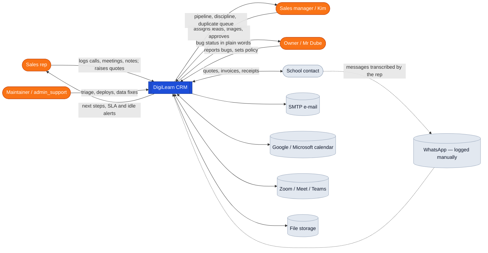
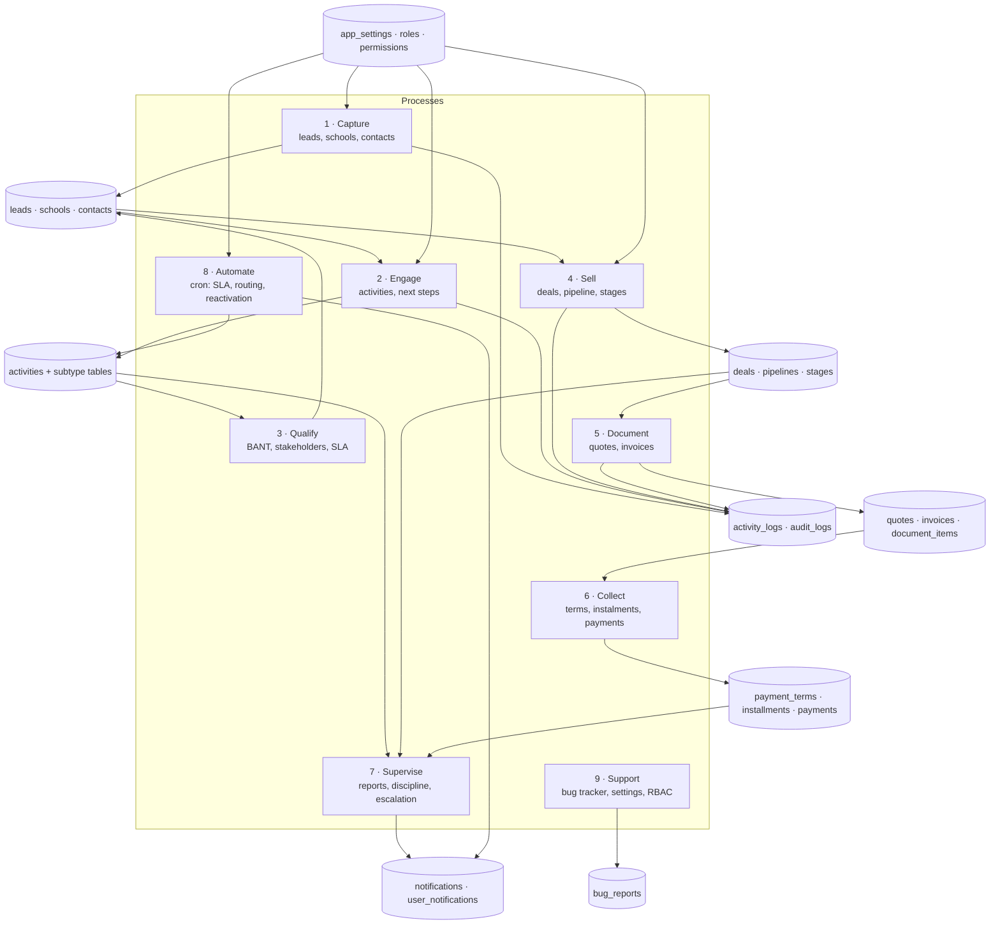
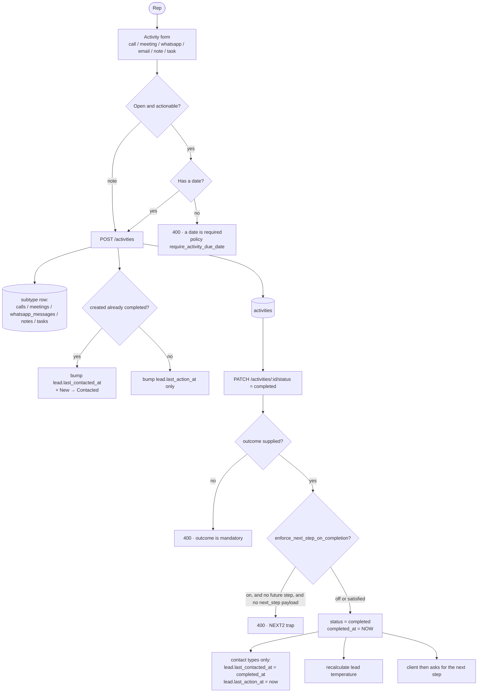
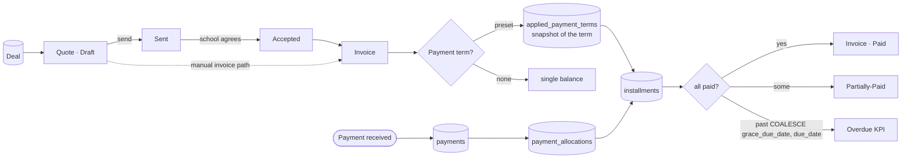
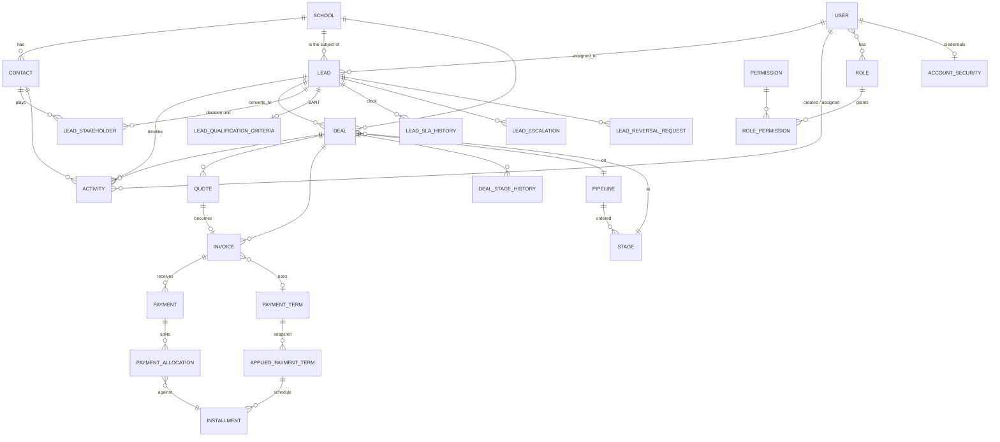
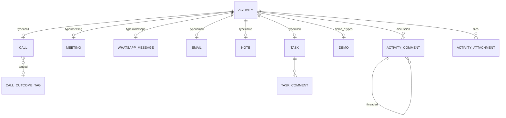
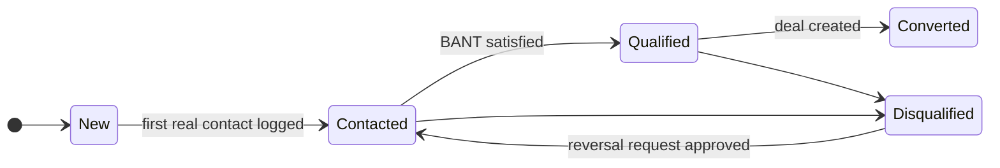
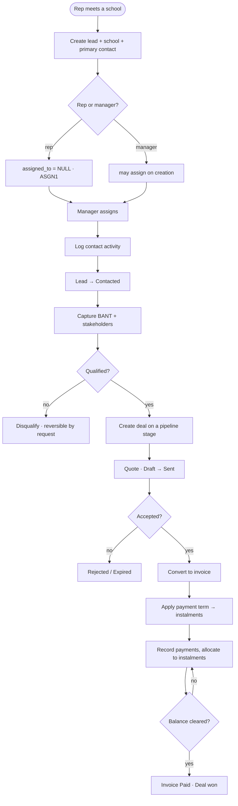
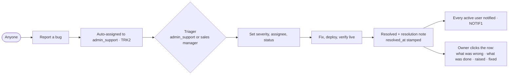
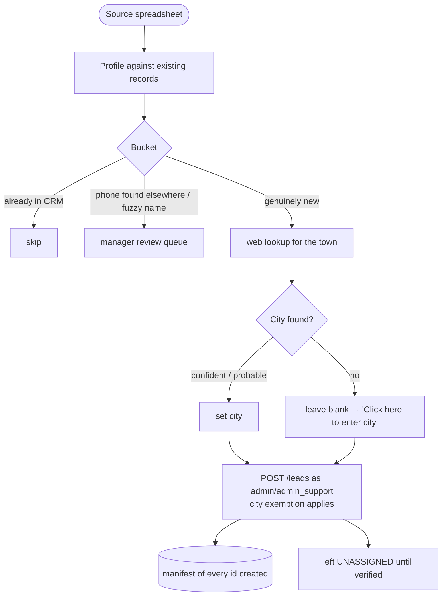

# Codebase Skeleton — DigiLearn CRM

**What this is.** The complete map of the system: what it is made of, how
data flows through it, how the pieces relate, the states things move
through, the rules that govern behaviour, and the traps that have already
cost time. Written to be read cold — if context is lost, start here.

Facts in this document were extracted from the code, not remembered.
Verify before contradicting. Companions: `BUGFIXES.md` (every incident,
newest first), `DEPLOYMENT-RULES.md`, `E2E-FINDINGS.md`,
`CREDENTIALS.local.md` (git-ignored).

---

## 1. What the system is

A CRM for selling interactive boards and digital classroom kit to
**schools in Zimbabwe**. Sales reps work leads attached to schools, log
calls/meetings/WhatsApps, run demos, raise quotes, convert them to
invoices with instalment payment terms, and collect payments. Managers
supervise pipelines, SLAs and discipline; the owner watches the whole.

Two apps, one repo, TypeScript throughout:

| | Path | Stack |
|---|---|---|
| API | `crm-v2-server/` | NestJS 11, TypeORM, PostgreSQL 16, JWT + CASL |
| Web | `crm-v2-client/` | React 19, Vite, TanStack Query, shadcn/ui, zod |

**35 server modules · 39 route prefixes · 65 entities · 12 scheduled jobs.**

Branches: **`dube-upgrades`** is the working branch and holds everything.
`main` is the baseline. `prod-ticketing` was a surgical cherry-pick
branch (July 2026); production has since returned to builds cut from
`dube-upgrades`.

---

## 2. Context diagram (DFD level 0)



---

## 3. Data-flow diagram (level 1)



**Reading it:** capture feeds engagement; engagement feeds qualification,
which writes back onto the lead (status, temperature, SLA). A qualified
lead becomes a deal, a deal produces documents, documents produce money.
Supervision reads across all three and emits notifications. Automation is
driven entirely by settings. Everything of consequence writes to
`activity_logs`.

---

## 4. Data-flow (level 2) — the two flows that matter most

### 4.1 Logging an activity and closing it out



The **NEXT2 trap** is live knowledge, not history: the client marks done
*first* and asks for the next step *after*, so it never sends the
`next_step` payload the server wants *before*. Keep the switch off.

The **propagation** box is why bulk-completing history is dangerous — it
rewrites `last_contacted_at` and silently resets idle/SLA detection.

### 4.2 Money: quote → invoice → instalments → payment



`applied_payment_terms` is a **snapshot**: changing a `PaymentTerm` later
does not rewrite documents already issued. The same principle governs
`document_items`, which copy the product name as text — renaming a
product rewrites only **Draft** lines (PROD-BOARD).

---

## 5. Entity relationships

### 5.1 The core



### 5.2 Activity and its subtype tables — the one inheritance pattern

`Activity` is the spine. Every activity row carries the common fields
(type, status, subject, dates, owner, parent record) and links **one-to-one**
to a detail table for its kind. This is class-table inheritance done by
hand, not TypeORM STI — there is no discriminator column beyond `type`.



**Consequences to respect:** a query that needs detail must
`leftJoinAndSelect` the subtype (`include_details=true` on the list
endpoint does this). Notes are exempt from most discipline rules —
they are passive logging and must never earn discipline points.

### 5.3 Everything else, by area

| Area | Entities |
|---|---|
| Auth / RBAC | `User`, `Role`, `Permission`, `RolePermission`, `AccountSecurity`, `AuthSession` |
| Activities | `Activity`, `Call`, `Meeting`, `WhatsAppMessage`, `Email`, `Note`, `Task`, `Demo`, `ActivityComment`, `ActivityAttachment`, `TaskComment`, `CallOutcomeTag` |
| Leads | `Lead`, `LeadStakeholder`, `LeadQualificationCriteria`, `LeadSLA`, `LeadSLAHistory`, `LeadEscalation`, `LeadReversalRequest`, `DuplicateSuspicion` |
| Schools | `School`, `Contact` |
| Pipeline | `Pipeline`, `Stage`, `Deal`, `DealStageHistory`, `DealRollbackRequest`, `DealHealthHistory`, `DealCompetitor` |
| Documents | `Quote`, `Invoice`, `DocumentItem`, `Product` |
| Money | `PaymentTerm`, `PaymentTermPeriod`, `AppliedPaymentTerm`, `Installment`, `Payment`, `PaymentAllocation`, `CashRequisition`, `RequisitionLineItem` |
| Comms | `Notification`, `UserNotification`, `NotificationPreference`, `EmailSequence`, `EmailQueue`, `EmailTemplate`, `UserEmailAccount` |
| Integrations | `UserCalendarConnection`, `CalendarEventLink`, `SchedulingLink`, `SchedulingHold`, `VideoProviderConnection`, `ManagedFile` |
| Ops | `Settings`, `ActivityLog`, `AuditLog`, `BugReport`, `Campaign` |

`AuditLog` exists but **nothing writes to it** (ticket AUD1). The real
trail is `activity_logs`. **Settings changes are recorded in neither** —
that gap is why we cannot say who switched the next-step gate on.

---

## 6. State machines



**Lead** `New · Contacted · Qualified · Disqualified · Converted`.
New → Contacted fires when an activity is **created already completed**
*or* completed later (STAT1 fixed the second path). Disqualification is
reversible only through `LeadReversalRequest`.

**Activity** `scheduled · in_progress · completed · cancelled · overdue`.
→ `completed` demands an `outcome` from a fixed enum of 28 values.
**The old CRM had only `scheduled` and `completed`** — no `cancelled` —
and used `scheduled` as "logged, never closed" (3,663 of 3,817 undated).

**Quote** `Draft · Sent · Accepted · Rejected · Expired`.
**Invoice** `Draft · Sent · Paid · Partially-Paid · Overdue · Cancelled`.
**Instalment** `pending · partially_paid · paid · overdue`.
**Deal close** `ongoing · won · lost`.
**Requisition** `DRAFT · SUBMITTED · MANAGER_APPROVED · FINANCE_APPROVED · PAID · REJECTED`.
**Bug** `open · in_progress · resolved · closed` (+ `resolved_at`).
**Duplicate suspicion** `pending · merged · kept_separate · false_positive`.

Reference vocabularies: provinces are the nine Zimbabwean ones; regions
are **only** `urban | rural` (a file saying "PERI URBAN" cannot import);
contact roles include Head, Deputy Head, Bursar, ICT Coordinator, SDC
Chair, Finance Committee.

---

## 7. Activity diagrams — the human journeys

### 7.1 Lead from capture to cash



### 7.2 Bug reported to resolved



### 7.3 Import of new schools



---

## 8. Permissions — read before touching any endpoint

Two layers, and they disagree more often than you would expect:

1. **`@Roles('admin', …)`** on the controller — the coarse gate.
   ~238 declarations across 39 controllers.
2. **CASL abilities** seeded per role in
   `database/seeds/seed-roles-permissions.ts`, whose JSON `conditions`
   (e.g. `{"assigned_to":"${id}"}`) services translate into SQL.

Hard-won facts:

- **`admin_support` satisfies `admin`** via `ROLE_ALIASES` in
  `auth/guards/roles.guard.ts` — it appeared in zero `@Roles()` and was
  locked out app-wide (R2).
- **Condition keys must match what the reader expects.** An unmapped key
  reaches Postgres as a column name: `createdBy` with no such column gave
  500s on Quotes and Invoices (R1); a seeded `assignedTo` where the deals
  board read `assigned_to` scoped **nothing**, silently (SEED1).
- **Production roles:** `nkululeko` admin (owner, Mr Dube);
  `prince@me.com` admin_support (maintainer); `mpofunk`/`busid`
  sales_manager (Kim, busi); `solomon` manager; `tanyag`/`manakedube`
  sales_rep.
- **Managers see every lead** (`conditions: null`); reps see their own.
  There is **no per-lead ACL** — you cannot restrict a lead to three
  named people. Unassigned hides a lead from reps, not from managers.

**Policy visibility rules:**
- **Activities follow the record's current owner** (R15). A rep sees an
  activity if they created it, are assigned it, or the parent lead/deal
  is theirs. Reassignment hands over the full history. Misses read
  **404**, never 403, so ids cannot be probed.
- **Bug tracker, three audiences:** owner (admin) — status + clickable
  plain-language detail, no aging; triagers (admin_support **and sales
  managers**, MGRBUG1) — everything plus controls; everyone else — their
  own reports.

---

## 9. Scheduled work (12 jobs)

| Cadence | Job |
|---|---|
| every 5 min | scheduling sweeper (holds expire) |
| every 15 min | e-mail sequence queue |
| every 30 min | SLA scheduler ×2, calendar reconciler |
| hourly | SLA escalation |
| every 2 h | SLA sweep |
| 02:00 daily | lead temperature recalculation |
| 07:00 daily | demo follow-up drafts |
| daily | follow-up discipline digest, unassigned-lead routing, lead reactivation |

Auto-routing is gated by `compliance.policy.auto_assign_enabled`
(**off**). The SLA idle check emitted 800 alerts in one run — treat it
with respect.

---

## 10. Domain rules that govern behaviour

- **Completing an activity has side effects**: stamps `completed_at` =
  now, and for contact types (call/meeting/whatsapp/email) bumps
  `lead.last_contacted_at` and `last_action_at`. Bulk-completing history
  therefore rewrites the record and resets idle/SLA detection. **Check
  what a transition propagates before running it a thousand times.**
- **`outcome` is a fixed enum, not free text.** Explanation belongs in
  `completion_note`. When the true result is unknown,
  `relationship_touchpoint_complete` asserts contact happened and no more.
- **Next-step compliance** (`enforce_next_step_on_completion`): the
  server wants the next step *before*, the client asks *after* and never
  sends the payload. Keep **off** until NEXT2 is built.
- **City is mandatory** for user-created schools, exempt for
  admin/admin_support so the bulk import can run. The exemption lives in
  **two** places — `SchoolsService` *and* the lead-creation path in
  `LeadsService`, because the import creates leads, not schools. Blank
  cities render "Click here to enter city"; **any** user may fill a
  missing one, only managers may change one already set.
- **New leads from reps are unassigned** (ASGN1); a manager assigns.
- **Hygiene score is client-side**, never stored
  (`src/lib/lead-hygiene.ts`): completeness 25 + activity discipline 30
  (open next step 12 / no overdue 6 / touched within 72 h 6 / outcome
  compliance over the last five completions 6, −3 for missing notes) +
  process 20 + BANT 25. Bands 90 / 75 / 60.
- **Duplicate detection** threshold 50. Schools carry no phone or e-mail,
  so the name alone must reach it: exact 50, near-exact 45 + one
  supporting signal (DUP4). Trigram similarity alone is unsafe —
  "DANDA HIGH" scores 1.00 against "Dandanda Primary".
- **Phone matching:** normalise to the **last 9 digits** (99.4% coverage;
  district is only 8% populated). A phone match alone must never
  auto-merge — 158 numbers are shared.
- **Snapshots are deliberate:** `applied_payment_terms` freezes the term;
  `document_items` copy the product name as text, so renaming a product
  rewrites **Draft** lines only.
- **Settings are cached in-process for 30 s** — a policy change lands
  within half a minute, not instantly.

---

## 11. Running it locally

- **PostgreSQL 16** portable at `C:\Users\8Y14\pgsql-local\pgsql`
  (data `…\pgsql-local\data`) on **127.0.0.1:5433** — 5432 is an
  unrelated system service, leave it alone. `start-local-postgres.ps1`.
- **API** `start-local-server.ps1` → :3001. **Web** `npm run dev` → :5173.
- **The legacy MySQL restore** — the pristine copy of the old live system
  — `start-local-mysql.ps1`, :3306, db `digilearn_crm_v2_live`.
  **Never mutated.** It is the only authority on "what did the old system
  actually hold" and has settled several arguments. Converted by
  `scripts/mysql-to-pg-etl.mjs`, a straight table copy with no status
  mapping.
- Local logins `nkululeko@clearhue.co.zw` / `doobsie81@gmail.com`, both
  `LocalAdmin2026`. Never put `#` in a dotenv value — dotenv truncates.

---

## 12. Environments and deployment

| | Client | API |
|---|---|---|
| staging | staging.digilearncrm.work | api-staging.digilearncrm.work/api/v2 |
| production | crm.digilearncrm.work | api.digilearncrm.work/api/v2 |

**CapRover** on a Contabo VPS (169.58.55.55); apps `api`/`crm` (prod),
`api-staging`/`staging`, `pg-prod`, `pg-staging`.

```bash
git archive --format=tar.gz -o /tmp/server.tar.gz HEAD:crm-v2-server
node <scratchpad>/caprover-deploy.mjs api-staging /tmp/server.tar.gz
```

Then **poll live behaviour until it promotes.** Builds take **10–20
minutes**; a finished build is not a promoted container, and
`isBuildFailed` alone proves nothing.

**Traps, all of which have bitten:**
- Key the wait on the behaviour of the build you just shipped — waiting
  on an older change's behaviour reports success on the wrong build.
- A poller dying with `ECONNRESET` usually means the container swapped
  mid-request: that is success, re-probe.
- The client bakes `VITE_PUBLIC_API_URL` at build time — it must be a
  CapRover app env var or the bundle points at localhost.
- Verify the client by fetching `/`, reading the bundle hash, and
  grepping it for a string the new build must contain.

**Rules (`DEPLOYMENT-RULES.md`, not optional):** staging first, verify
live per affected role, then **explicit** sign-off for production.
"Push" alone never means production.

---

## 13. Migrations and seeds

`database/migrations/<timestamp>-<Name>.ts`, run at boot when
`DB_RUN_MIGRATIONS=true`. **Always guard** with `hasTable`/`hasColumn` so
a rerun is a no-op — `1768…-AddBugReportResolvedAt.ts` and
`1769…-MakeSchoolCityNullable.ts` are the house style. Write a real
`down()`. `DB_SYNCHRONIZE` stays **false** everywhere.

Seeds run when `DB_RUN_SEEDS=true` and only affect fresh environments —
live rows keep what they have, which is how a seed/reader mismatch hides
for months (SEED1).

---

## 14. Working practices

- **Fix bugs on discovery and always document them** in `BUGFIXES.md`:
  symptom, root cause, fix, data impact. File tickets on **both**
  trackers, staging and production.
- **Write for the reader.** The owner and the sales managers read these
  tickets. Plain words: what went wrong, what it meant for them, what was
  done.
- **Never invent data to satisfy a rule.** Leave it blank or say "not
  known". Numbers scope a problem; they do not name a person.
- **Read the file before naming a cause** — two wrong diagnoses (SC2,
  DUP3) came from reasoning off a summary instead of opening the code.
- **Prefer reversible.** Write a manifest or undo file before any bulk
  change (`undo-closeoff-prod-2026-07-23.csv`, `nash-manifest-prod.json`
  are the pattern); dry-run by default, `--apply` to commit.
- **Verify live, per role.** A green build proves nothing about
  production.

---

## 15. Environment quirks

- Windows + Git Bash. PowerShell here-strings mangle quotes — use
  `git commit -F <file>`.
- The permission classifier blocks SSH, production settings writes, bulk
  production mutations and reading credential material; those steps are
  handed to the user to run with `!`. What does work:
  `TOKEN=$(curl -s … /auth/login …) && curl -s … -d @body.json`.
- For SSH handed to the user: **base64 the whole remote script** (a
  `$argon2…` string passed as an ssh argument is expanded by the remote
  shell) and **write it to a temp file before running** — piping a script
  into `bash` lets an inner `docker exec -i` swallow the rest of it, and
  it fails silently.
- `tar --force-local` works only in Git Bash; `git archive` sidesteps it.
- Keep scratch scripts in the session scratchpad, never the repo root.
