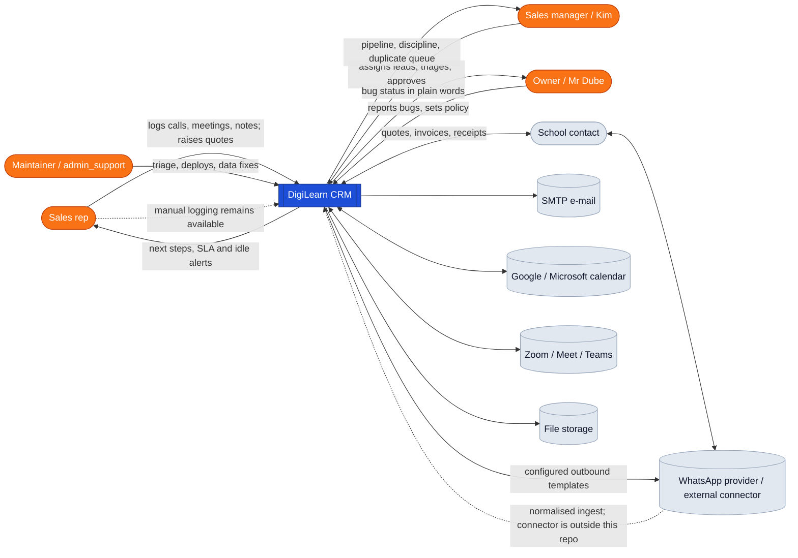
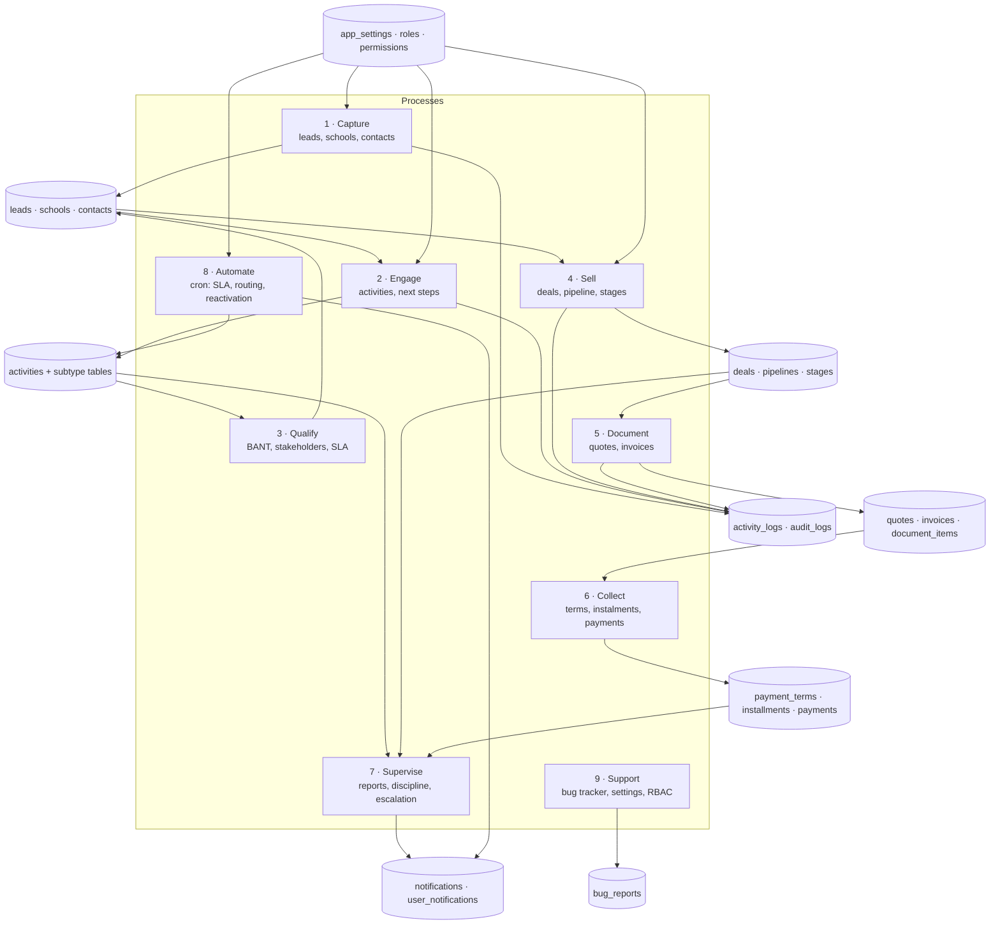
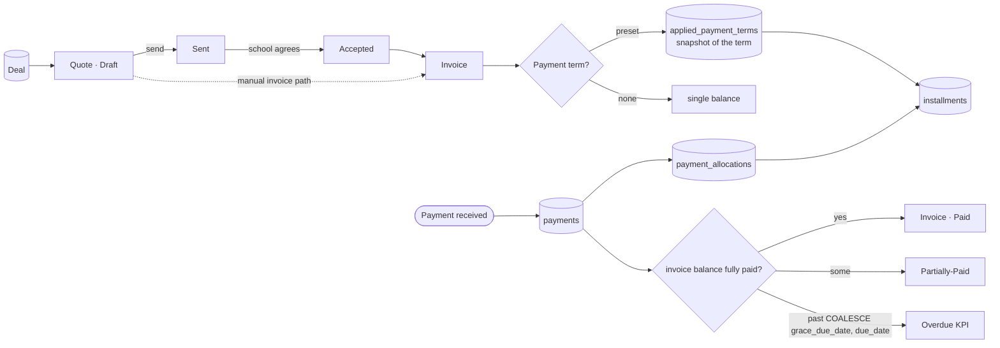
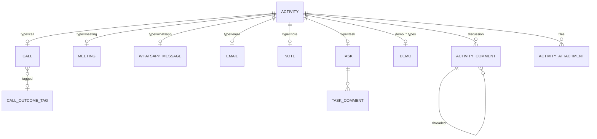
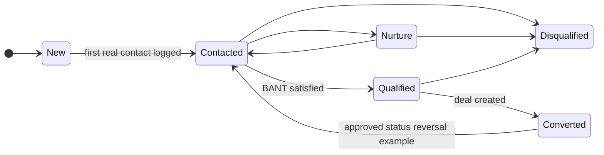
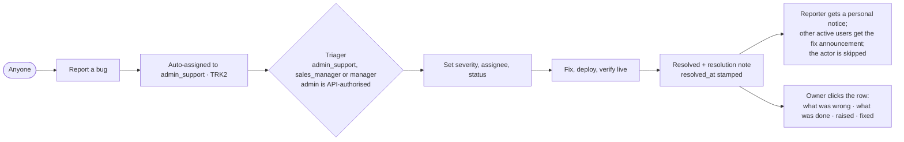

# Codebase Skeleton — DigiLearn CRM

**What this is.** The complete map of the system: what it is made of, how
data flows through it, how the pieces relate, the states things move
through, the rules that govern behaviour, and the traps that have already
cost time. Written to be read cold — if context is lost, start here.

Code-derived facts in this document were re-verified against the repository
on **2026-07-29**. Historical measurements and live-environment facts are
labelled as operational evidence; code alone cannot prove that they are still
true. Verify live state before acting on those claims. Companions:
`BUGFIXES.md` (every incident, newest first), `DEPLOYMENT-RULES.md`,
`CREDENTIALS.local.md` (git-ignored). Frozen build-phase reports and the
old E2E findings now live under `docs/archive/`.

---

## Corrections — 2026-08-18 (deltas since the 2026-07-29 pass)

The body below still reads as of 2026-07-29. Verified deltas, apply when reading:

- **Counts:** entities **66 → 68** (adds `LeadImportBatch`, `PaymentEntryRequest`);
  `@Cron` scheduled jobs **14 → 15** (adds the daily 01:00 quote-expiry sweep,
  `quotes.service.ts` `expireOverdueQuotes`); `@Roles` declarations **244 → 271**
  (same 39 controllers). Modules 35 and controllers 41 unchanged.
- **New workflows not yet in §5.3/§7.3/§9.1:** XLSX lead importer
  (`leads/services/leads-xlsx-import.service.ts` + `lead-import-batch` entity +
  `POST /leads/import`, `import/batches/:id/approve|reject`); payment-entry
  approval (`PaymentEntryRequest` + `GET /payments/requests`,
  `PATCH /payments/requests/:id/review`).
- **Signal-driven lead lifecycle** (not in §4/§6/§10): demo activity types
  `DEMO_BOOKING/DELIVERY/FOLLOWUP` + demo sub-row; `lead.commercial_intent` +
  intent-driven conversion; the 28-value outcome enum now includes a 12-value
  demo-lifecycle bucket.
- **Follow-up suite (on the deployed prod branch `tickets-1114-on-baseline`,
  api v42 / crm v34 — NOT on the local `port-2026-08-15` working tree):** FU6
  emitter `automation/services/followup-reminder.service.ts` (hourly cron,
  owner-scoped, dedupe) + `POST /automation/followup-reminders/run`; FU1
  `getNurtureFollowUps` rewrite (`dashboard.service.ts`); FU3/FU4 activity owner
  fallback + email follow-up task (`activities.service.ts`); ACT6 completion
  reuse; CONTACT-ADV1 (logged call/WhatsApp marks lead Contacted,
  `create-activity-modal.tsx`). The bug tracker's redundant Priority column/field
  was removed (severity is the single signal).
- **Automation routes to add to §9.1:** `assignment-proposals/projection`,
  `ingest/whatsapp`, `handoff/social-lead`, `quote-draft/:dealId`,
  `attribution/sources`.
- **Path/label fixes:** §8 seed path is `crm-v2-server/src/database/seeds/
  seed-roles-permissions.ts` (skeleton drops the `src/`); §1 checked-out branch
  is `port-2026-08-15`, not `dube-upgrades`.
- **Still correct:** lead statuses 6, provinces 10, contact roles 9, outcome
  count 28, `ROLE_ALIASES admin_support→admin`, and the key constant/guard paths.

---

## 0. Where the information lives

Read in this order from cold. Everything below is in this repository
unless stated.

| | |
|---|---|
| **This file** | the map: architecture, permissions, deployment, domain rules, quirks |
| **`BUGFIXES.md`** | every incident: symptom, cause, fix, data impact. Newest first |
| **`SOLUTIONS.local.md`** | independent code audit (2026-07-28), 34 findings with file and line. Draft, git-ignored — local only |
| **`METRICS-AUDIT.md`** | which dashboard numbers can be trusted, and which cannot |
| **`WANEZI-CONSOLIDATION.md`** | the duplicate-school tangle behind Njabulo Mathwasa's payment |
| **`DEPLOYMENT-RULES.md`** | staging first, verify per role, explicit sign-off |
| **`ops/manifests/`** | retained reversal records for the listed bulk data changes — see below |
| **`CREDENTIALS.local.md`** | secrets. Git-ignored, never committed |
| **`docs/archive/`** | frozen one-time reports (original build phases A–E, demo intent, old E2E findings). Historical, not needed day-to-day |
| **The bug tracker itself** | ~130 tickets on production and staging, written in plain language. The richest source: each carries evidence, measurements and what was ruled out |

**`ops/manifests/` — how to undo things:**

- `nash-manifest-prod.json` — 368 created **lead rows**, each with a lead id
  and school id, referencing 365 unique school ids; it also records 3 skipped
  inputs and 0 failures. It contains no contact ids and does not encode which
  schools pre-existed, so those two facts require separate import evidence.
- `removed-import-leads-prod.json` — the 368 leads later removed from that
  import, schools and contacts kept.
- `undo-closeoff-prod-2026-07-23.csv` — the 1,287 activities the 23 July
  close-off cancelled, with the status each held before.

**One-off production mutation scripts live in the session scratchpad, not
here.** Maintained application/ETL scripts do exist under `scripts/`; the
scratchpad rule applies to disposable data-fix tooling. For a bulk mutation,
the retained manifest is the recovery artifact.

**The two databases are the arbiter.** When a claim about behaviour is in
doubt, check the pristine restore of the previous system (see §11) against
production. Several disputes this week were settled that way, and at least
two "fixes" were abandoned because the evidence contradicted the premise.

---

## 1. What the system is

A CRM for selling interactive boards and digital classroom kit to
**schools in Zimbabwe**. Sales reps work leads attached to schools, log
calls/meetings/WhatsApps, run demos, raise quotes, convert them to
invoices with instalment payment terms, and collect payments. Managers
supervise pipelines, SLAs and discipline; the owner watches the whole.

Two apps, one repo, TypeScript throughout:

| | Path | Stack |
|---|---|---|
| API | `crm-v2-server/` | NestJS 11, TypeORM, PostgreSQL (`pg`), JWT + CASL |
| Web | `crm-v2-client/` | React 19, Vite, TanStack Query, shadcn/ui, zod |

**35 server modules · 41 controllers (39 literal prefixes + 2 prefixless
controllers) · 66 entities · 14 scheduled jobs.**

Repository snapshot: **`dube-upgrades`** is the checked-out working branch;
`main` is the baseline and `prod-ticketing` is the July 2026 surgical
cherry-pick branch. Which branch production currently runs is operational
state and must be checked against the deployed build.

---

## 2. Context diagram (DFD level 0)



---

## 3. Data-flow diagram (level 1)



**Reading it:** capture feeds engagement; engagement feeds qualification,
which writes back onto the lead (status, temperature, SLA). A qualified
lead becomes a deal, a deal produces documents, documents produce money.
Supervision reads across all three and emits notifications. Automation is
only **partly** settings-driven: cron schedules live in code and some jobs
are unconditional, while selected policies and thresholds come from
settings. Many core CRUD paths write to `activity_logs`, but coverage is not
universal; settings, authentication/RBAC and several support/integration
paths do not. `audit_logs` currently has no wired writer.

---

## 4. Data-flow (level 2) — the two flows that matter most

### 4.1 Logging an activity and closing it out

```mermaid
flowchart TB
  rep([Rep]) --> f[Activity form<br/>call / meeting / whatsapp / email / note / task]
  f --> v{Open and actionable?}
  v -->|yes| dat{Has a date?}
  v -->|note| save
  dat -->|no, gate enabled| rej[400 · a date is required<br/>require_activity_due_date defaults true]
  dat -->|yes| save[POST /activities]
  save --> sub[(subtype row:<br/>calls / meetings / whatsapp_messages / notes / tasks)]
  save --> act[(activities)]
  save --> mode{created already completed?}
  mode -->|yes, contact type| touch[bump lead.last_contacted_at<br/>+ New → Contacted]
  mode -->|no, contact type| sched[bump lead.last_action_at<br/>+ New → Contacted]

  act --> comp[PATCH /activities/:id/status = completed]
  comp --> oc{outcome supplied?}
  oc -->|no| rej2[400 · outcome is mandatory]
  oc -->|yes| gate{actionable work on an<br/>active lead / deal?}
  gate -->|yes, no next_step payload| rej3[400 · next step required]
  gate -->|terminal / standalone| done[status = completed<br/>completionMoment()]
  gate -->|next_step supplied| tx[one transaction:<br/>complete source + create dated follow-up<br/>+ matching subtype row]
  tx --> done
  done --> prop[contact types only:<br/>last_contacted_at moves forward only<br/>last_action_at = now]
  done --> prompt[client closes the loop]
```

The normal completion flow collects the outcome, note and next-step decision
before sending `PATCH /activities/:id/status`. For actionable work on an active
lead or deal, the server requires `next_step` for every role and does not treat
an unrelated existing task as satisfaction. Completion, the new Activity and
its Task/Call/Email/Meeting/WhatsApp subtype are one transaction. Call,
WhatsApp and Email select the intended contact (auto-selecting a sole person);
the atomic payload carries that contact id. Missing channel evidence can be
captured and audit-saved on the contact before scheduling. The server validates
that an explicitly selected contact belongs to the parent lead's school before
using that person's phone/email in the transaction.

After-the-fact paths (an inline interaction created already complete, generic
update safety net, and bulk completion) enqueue a blocking `stage=next-step`
obligation. These obligations persist in tab `sessionStorage`, restore after a
refresh and cannot be dismissed until the record has a dated future/decision.

The **propagation** box is why bulk-completing history is dangerous — it
updates activity and lead timestamps. `completionMoment()` uses the
activity's due/scheduled date when it is more than 24 hours old, otherwise
now; `last_contacted_at` only moves forward. Reopening currently changes
status but does **not** clear `completed_at`, outcome or completion note.

**Enforcement boundaries (verified, not intended-policy prose):**

- `PATCH /activities/:id/status` and bulk completion always require an
  outcome. `POST /activities` can create a completed row without one, and
  `PUT /activities/:id` can change status without the status-transition
  side effects. The `enforce_outcome_on_completion` setting is defined and
  editable but is not read by server code.
- The single-item status route enforces a future next-step payload before
  persistence. Bulk and generic/update-created completions use the persisted
  client obligation described above; they do not currently carry one atomic
  next-step payload per row.
- A supplied `next_step` is inserted in the same transaction as completion,
  including the matching subtype row. A failure rolls the completion back.
- Lead temperature is recalculated after activity **creation**, including a
  create that arrives completed, but not when an existing activity is later
  completed through the status route.

### 4.2 Money: quote → invoice → instalments → payment



`applied_payment_terms` is a **snapshot**: changing a `PaymentTerm` later
does not rewrite documents already issued. The same principle governs
`document_items`, which copy the product name as text — renaming a
product rewrites only **Draft** lines (PROD-BOARD).

---

## 5. Entity relationships

### 5.1 The core


### 5.2 Activity and its subtype tables — the one inheritance pattern

`Activity` is the spine. Every activity row carries the common fields
(type, status, subject, dates, owner, parent record) and the application
convention links it **zero-or-one** to the detail table for its kind. This is
class-table inheritance done by hand, not TypeORM STI. The database does not
enforce “exactly one matching subtype”, so orphaned or mismatched rows remain
possible.



**Consequences to respect:** a query that needs detail must
`leftJoinAndSelect` the subtype (`include_details=true` on the list
endpoint does this). Notes are exempt from most discipline rules —
they are passive logging and must never earn discipline points.

### 5.3 Everything else, by area

| Area | Entities |
|---|---|
| Auth / RBAC | `User`, `Role`, `Permission`, `RolePermission`, `AccountSecurity`, `AuthSession` |
| Activities | `Activity`, `Call`, `Meeting`, `WhatsAppMessage`, `Email`, `Note`, `Task`, `Demo`, `ActivityComment`, `ActivityAttachment`, `TaskComment`, `CallOutcomeTag` |
| Leads | `Lead`, `LeadStakeholder`, `LeadQualificationCriteria`, `LeadSLA`, `LeadSLAHistory`, `LeadEscalation`, `LeadReversalRequest`, `DuplicateSuspicion` |
| Schools | `School`, `Contact` |
| Pipeline | `Pipeline`, `Stage`, `Deal`, `DealStageHistory`, `DealRollbackRequest`, `DealHealthHistory`, `DealCompetitor` |
| Documents | `Quote`, `Invoice`, `DocumentItem`, `Product` |
| Money | `PaymentTerm`, `PaymentTermPeriod`, `AppliedPaymentTerm`, `Installment`, `Payment`, `PaymentAllocation`, `CashRequisition`, `RequisitionLineItem` |
| Comms | `Notification`, `UserNotification`, `NotificationPreference`, `EmailSequence`, `EmailQueue`, `EmailTemplate`, `UserEmailAccount` |
| Integrations | `UserCalendarConnection`, `CalendarEventLink`, `SchedulingLink`, `SchedulingHold`, `VideoProviderConnection`, `ManagedFile` |
| Ops / automation | `Settings`, `ActivityLog`, `AuditLog`, `BugReport`, `Campaign`, `LeadAssignmentProposal` |

`AuditLog` exists but **nothing writes to it** (ticket AUD1). The real
trail for the modules that participate is `activity_logs`; it is not a
complete application audit trail. **Settings changes are recorded in
neither** — that gap is why code cannot say who changed a policy value.

---

## 6. State machines

The diagram below is the **common business lifecycle**, not an enforced
transition matrix. `transitionStatus()` accepts any value allowed by the DTO
and only adds a minimum-data check when entering `Qualified`.



**Lead** `New · Contacted · Nurture · Qualified · Disqualified · Converted`.
New → Contacted fires when an activity is **created already completed**
*or* completed later (and currently also when a contact activity is merely
scheduled). `LeadReversalRequest` serves three workflows:
`status_reversal` rolls a **Converted** lead back to any non-Converted
status; `tactical_disqualify` requests approval for selected disqualification
reasons; and `reassignment` requests a new owner. It is not a generic
Disqualified → Contacted mechanism.

**Activity** `scheduled · in_progress · completed · cancelled · overdue`.
The single-status and bulk-status completion routes demand an `outcome` from
a fixed enum of 28 values; see §4.1 for the create/generic-update bypasses.
**The old CRM had only `scheduled` and `completed`** — no `cancelled` —
and used `scheduled` as "logged, never closed" (3,663 of 3,817 undated).

**Quote** `Draft · Sent · Accepted · Rejected · Expired`.
**Invoice** `Draft · Sent · Paid · Partially-Paid · Overdue · Cancelled`.
**Instalment** `pending · partially_paid · paid · overdue`.
**Deal close** `ongoing · won · lost`.
**Requisition** `DRAFT · SUBMITTED · MANAGER_APPROVED · FINANCE_APPROVED · PAID · REJECTED`.
**Bug** `open · in_progress · resolved · closed` (+ `resolved_at`).
**Duplicate suspicion** `pending · merged · kept_separate · false_positive`.

Reference vocabularies: the code accepts **10** province/city-province
values (including Harare and Bulawayo; the two Matabeleland values are
spelled `Matebeleland` in the enum). Regions are **only**
`urban | rural` (a file saying "PERI URBAN" cannot import). Contact roles
are Head, Deputy Head, Bursar, ICT Coordinator, SDC Chair, Finance
Committee, Teacher, Administrator and Other.

---

## 7. Activity diagrams — the human journeys

### 7.1 Lead from capture to cash


### 7.2 Bug reported to resolved



### 7.3 Import of new schools


---

## 8. Permissions — read before touching any endpoint

Two layers, and they disagree more often than you would expect:

1. **`@Roles('admin', …)`** on the controller — the coarse gate.
   244 declarations across 39 controllers (two of the 41 controllers have
   no `@Roles` declaration).
2. **CASL abilities** seeded per role in
   `database/seeds/seed-roles-permissions.ts`, whose JSON `conditions`
   (e.g. `{"assigned_to":"${id}"}`) services translate into SQL.

Hard-won facts:

- **`admin_support` satisfies `admin`** via `ROLE_ALIASES` in
  `auth/guards/roles.guard.ts`. Most controllers still rely on that alias;
  the bug-report controller also enumerates `admin_support` through role
  arrays.
- **Condition keys must match what the reader expects.** An unmapped key
  reaches Postgres as a column name: `createdBy` with no such column gave
  500s on Quotes and Invoices (R1); a seeded `assignedTo` where the deals
  board read `assigned_to` scoped **nothing**, silently (SEED1).
- **Seeded policy:** managers see every lead (`conditions: null`); reps see
  their own (`ownerId` maps to `assigned_to`).
  There is **no per-lead ACL** — you cannot restrict a lead to three
  named people. Unassigned hides a lead from reps, not from managers.
  Actual production user/role assignments are live data, not code facts.

**Policy visibility rules:**
- **Activity reads** follow the record's current owner (R14/R15). A rep can
  read an activity they created, are assigned, or whose parent lead/deal is
  theirs; misses return **404**. This does **not** currently protect the
  create, generic update, status-update or bulk-status write paths, which do
  not pass an owner scope into the service.
- **Bug tracker, three client audiences:** product owner (`admin`) gets the
  status/detail view without aging or triage controls; triagers
  (`admin_support`, `sales_manager`, `manager`) get the full workspace;
  everyone else gets their own reports. The API's triage allowlist also
  includes `admin`, so the server is broader than the admin client view.

---

## 9. Scheduled work (14 jobs)

| Cadence | Job |
|---|---|
| every 5 min | scheduling sweeper (holds expire) |
| every 15 min | e-mail sequence queue; SLA pre-breach nudge; unassigned-lead routing proposals |
| every 30 min | demo follow-up SLA; general SLA breach; deal-stage SLA breach; calendar reconciler |
| hourly | SLA escalation check |
| every 2 h | idle-lead check |
| 02:00 daily | lead temperature recalculation |
| 06:00 daily | follow-up discipline digest |
| 06:30 daily | lead reactivation |
| 07:00 daily | demo follow-up drafts |

Auto-routing is gated by `compliance.policy.auto_assign_enabled`
(default **off**, runtime DB-controlled). It creates assignment
**proposals** for manager approval; it does not directly reassign leads.
Operational incident history records one SLA idle pass emitting 800 alerts.

### 9.1 Auto-assign suite (manager Approval Queue → Auto-assign tab)

**AUTO-EQUITY correction (12 Aug 2026, code complete; deployment pending):**
the normal workflow no longer requires the separate Rebalance panel. A run
uses projected full-book load (existing book + pending proposals), catches
lighter reps up to the heaviest starting book first, then applies territory to
the remainder while keeping the projected gap strictly below 50. With the
current live numbers the result is expected to be one apart, but 0/1 is not a
general invariant. Redirect can target an active rep or manager, including the
approving manager. Existing assigned leads are never moved by distribution.

`automation/services/lead-auto-router.service.ts` + `automation.controller.ts`
(`/automation/assignment-proposals/*`, `/automation/rebalance`) back the manager
Auto-assign workspace. Built on the staging line (`dube-upgrades`), then
**shipped to production** (api `0.0.24`→`0.0.26`, 06–07 Aug 2026) after Kim
approved it on staging — verify the deployed build for the live version. On
prod the cron stays OFF (`auto_assign_enabled=false`) while the manual
"Run auto-assign" button still works; `auto_assign_include_managers=false`.
The engine PROPOSES — a manager decides:

- **Distribution** (`runDistribution` / the "Run auto-assign" button + the
  `auto_assign_enabled` cron): the distributable pool = unassigned + never-worked
  (no activity) + non-terminal + not already proposed. It first catches every
  lighter projected full book up to the heaviest starting book, then applies
  **territory** (`users.territory_provinces`) to the remainder while keeping the
  projected gap strictly below `FAIRNESS_GAP = 50`. No covering rep / blank
  province falls back to the lightest eligible projected workload. Recipients = active `sales_rep`s with a
  territory; managers only if `auto_assign_include_managers` (capped by
  `manager_lead_cap`). Approval — not proposal — is when the lead gets its owner
  and the first-touch SLA clock starts.
- **Decisions:** approve (single / batch / **Approve-all** with a chunked
  progress bar), **reject** (proposal → the top-level *Rejected* tab, lead stays
  unassigned), **redirect** a rejected proposal to any rep/manager, **send to New
  Leads** (lead → New/unassigned + re-run duplicate detection). Bulk redirect /
  bulk send-to-New-Leads on the rejected list.
- **Undo** (`undoApprovals`, `POST …/assignment-proposals/undo`): reverses an
  approval — lead → unassigned, proposal → PENDING, the approval's SLA clock
  cleared. **Blocked** if the lead has since been worked (any activity) or was
  hand-reassigned, so it never strips a lead a rep is on. Surfaced as an "Undo"
  action on the approve toast.
- **Legacy Rebalance** (`rebalance`, `/automation/rebalance`, REBAL1; UI hidden
  after AUTO-EQUITY): a manager moves a
  batch of leads between two reps — preview then commit, keeps the ≤50 gap, moves
  unworked leads first, and is **cross-territory allowed** (a deliberate hand move
  is not bound by the territory filter that governs auto-distribution). Two
  modes, chosen by whether a `campaign_id` is passed:
  - **Import balance before approval (REBAL-PRE, the normal case):** when a
    campaign is given, the balancer moves pending **proposals** (reassigns
    `proposed_rep_id`), not assigned leads, so approval assigns each lead
    **once** — no assign-then-reassign, no SLA started-then-cleared. `want =
    (from − to) / 2` meets the two reps in the middle, i.e. brings the lighter
    one **up to level** with the heavier and stops (the 50-gap caps overshoot).
  - **EQUITY1 basis (07 Aug 2026):** the projected load it balances on is each
    rep's **full book** (every non-deleted lead they hold, *including*
    Converted/Disqualified — `getBookLeadCounts`), not the open-only count that
    distribution fairness uses. A rep who has already closed a lot of leads has
    still done that work and isn't handed extra to "catch up" on an open count.
    The R2 projection strip shows the same full-book basis so the numbers match.
    Each proposal moved **out of its territory** for equity has its `reason`
    rewritten to say so ("… is X's territory, but goes to Y for workload
    equity, not territory"), so a manager reading the queue understands why an
    out-of-territory lead is proposed to a rep.
  - **Legacy assigned-lead move:** with no campaign, it moves already-assigned
    leads (`pickRebalanceLeads`), unworked first, on the open-lead count.

Entity: `LeadAssignmentProposal` (status `pending·approved·rejected·superseded`).
Deleting a lead supersedes its pending proposals so none dangle as orphan rows.

---

## 10. Domain rules that govern behaviour

- **Active Leads** is a server-side lifecycle view, not an assignment filter:
  every visible, non-deleted lead except Disqualified and Converted. Unassigned
  live leads therefore count as Active. **All Leads** remains a separate first
  tab and sends no status/active filter.
- **Disqualification evidence:** every rep request carries a controlled reason
  plus mandatory explanation. Sales-manager approval applies Disqualified in
  the decision transaction. Direct manager/admin decisions record the same
  approved evidence. Status-only and bulk routes cannot bypass this workflow.
  Legacy rows retain `leads.reason`; missing approval/note fields display as
  legacy/not recorded rather than being invented.
- **Customer contact identity:** email is optional; blank is stored as NULL and
  nonblank input is normalized/validated. Internal domains, the shared admin
  address and exact active-user emails are not valid customer contacts. Active
  staff email/name evidence is excluded from duplicate scoring while real
  customer phone/school/name evidence remains eligible.

- **Completing an activity has side effects**: `completionMoment()` stamps
  old work with its own due/scheduled date and recent/undated work with now.
  For contact types (call/meeting/whatsapp/email), it moves
  `lead.last_contacted_at` forward only and sets `last_action_at` to now.
  Bulk-completing history still mutates parent records. **Check what a
  transition propagates before running it a thousand times.**
- **`outcome` is a fixed enum, not free text.** Explanation belongs in
  `completion_note`. When the true result is unknown,
  `relationship_touchpoint_complete` asserts contact happened and no more.
- **Next-step compliance:** single-item completion of actionable work on an
  active lead/deal always requires the next step before completion, regardless
  of role or another open task. The setting remains in the settings catalogue
  for compatibility but no longer weakens this completion invariant. See §4.1
  for the explicitly after-the-fact bulk/create safety-net boundary.
- **City is mandatory** for user-created schools, exempt for
  admin/admin_support so the bulk import can run. The exemption lives in
  **two** places — `SchoolsService` *and* the lead-creation path in
  `LeadsService`, because the import creates leads, not schools. Blank
  cities render "Click here to enter city"; **any** user may fill a
  missing one. The overwrite allowlist is exactly `admin`,
  `admin_support`, `sales_manager`; the separate `manager` role is not
  included despite the error text saying “ask a manager”.
- **New leads from reps are unassigned** (ASGN1); a manager assigns.
- **Hygiene score is client-side**, never stored
  (`src/lib/lead-hygiene.ts`): completeness 25 + activity discipline 30
  (open next step 12 / no overdue 6 / touched within 72 h 6 / outcome
  compliance over the last five completions 6, −3 for missing notes) +
  process 20 + BANT 25. Bands 90 / 75 / 60.
- **Duplicate detection** threshold 50. Schools carry no phone or e-mail,
  so token-Jaccard name similarity ≥0.95 contributes 50; ≥0.75 contributes
  45 and needs city/district support (DUP4). The application does not use
  PostgreSQL trigram similarity for this check.
- **Phone matching has two different rules:** the running application
  strips non-digits and compares the **full** normalized string. The “last
  9 digits” rule and its 99.4% coverage figure came from operational import
  reconciliation, not application code. A match raises a candidate; this
  service does not auto-merge records.
- **Snapshots are deliberate:** `applied_payment_terms` freezes the term;
  `document_items` copy the product name as text, so renaming a product
  rewrites **Draft** lines only.
- **Settings are cached in-process for 30 s** — a policy change lands
  within half a minute, not instantly.

---

## 11. Running it locally

- **PostgreSQL 16.9** portable at `C:\Users\8Y14\pgsql-local\pgsql`
  (data `…\pgsql-local\data`) on **127.0.0.1:5433** — 5432 is an
  unrelated system service, leave it alone. `start-local-postgres.ps1`.
- **API** `start-local-server.ps1` → :3001. **Web** `npm run dev` → :5173.
  Do not use `start-local-client.ps1` unchanged: it currently points the web
  app at API port **3000**, which conflicts with the server launcher.
- **The legacy MySQL restore** — the pristine copy of the old live system
  — `start-local-mysql.ps1`, :3306, db `digilearn_crm_v2_live`.
  **Never mutated.** It is the only authority on "what did the old system
  actually hold" and has settled several arguments. Converted by
  `scripts/mysql-to-pg-etl.mjs`, a straight table copy with no status
  mapping.
- Local bootstrap/login material belongs in `CREDENTIALS.local.md` or the
  local launcher, not this committed map. In dotenv files, quote values
  containing `#`; an unquoted `#` starts a comment.

---

## 12. Environments and deployment

This section is an **operational snapshot**, not derivable from TypeScript.
Confirm DNS, CapRover app configuration and the deployed bundle before using
it as current state.

| | Client | API |
|---|---|---|
| staging | staging.digilearncrm.work | api-staging.digilearncrm.work/api/v2 |
| production | crm.digilearncrm.work | api.digilearncrm.work/api/v2 |

**CapRover** on a Contabo VPS (169.58.55.55); apps `api`/`crm` (prod),
`api-staging`/`staging`, `pg-prod`, `pg-staging`.

```bash
git archive --format=tar.gz -o /tmp/server.tar.gz HEAD:crm-v2-server
node <scratchpad>/caprover-deploy.mjs api-staging /tmp/server.tar.gz
```

Then **poll live behaviour until it promotes.** Builds take **10–20
minutes**; a finished build is not a promoted container, and
`isBuildFailed` alone proves nothing.

**Traps, all of which have bitten:**
- Key the wait on the behaviour of the build you just shipped — waiting
  on an older change's behaviour reports success on the wrong build.
- A poller dying with `ECONNRESET` usually means the container swapped
  mid-request: that is success, re-probe.
- The client bakes `VITE_PUBLIC_API_URL` at build time — it must be a
  CapRover app env var or the bundle points at localhost.
- Verify the client by fetching `/`, reading the bundle hash, and
  grepping it for a string the new build must contain.

**Rules (`DEPLOYMENT-RULES.md`, not optional):** staging first, verify
live per affected role, then **explicit** sign-off for production.
"Push" alone never means production.

---

## 13. Migrations and seeds

`database/migrations/<timestamp>-<Name>.ts` run automatically whenever
`NODE_ENV=production`; `DB_RUN_MIGRATIONS=true` opts development into the
same behavior. Incremental migrations generally guard table/column creation
(`1768…` and `1769…` are the clearest house style), and all current TypeScript
migrations define `down()`.

Production forces TypeORM `synchronize=false`. The checked-in local launcher
also sets it false, but generic development defaults to **true** when
`DB_SYNCHRONIZE` is absent (and `.env.example` says true). Do not assume it is
false everywhere.

Seeds run automatically in production or when `DB_RUN_SEEDS=true`. They are
idempotent but not “fresh-only”: they add missing roles, permissions and
role-permission links to existing databases. They deliberately do **not**
update conditions on existing links, so a stale condition can survive a
restart (SEED1). Bootstrap-admin creation is fresh-environment guarded. Seed
failure is logged and does not abort application startup.

---

## 14. Working practices

- **Fix bugs on discovery and always document them** in `BUGFIXES.md`:
  symptom, root cause, fix, data impact. File tickets on **both**
  trackers, staging and production.
- **Write for the reader.** The owner and the sales managers read these
  tickets. Plain words: what went wrong, what it meant for them, what was
  done.
- **Never invent data to satisfy a rule.** Leave it blank or say "not
  known". Numbers scope a problem; they do not name a person.
- **Read the file before naming a cause** — two wrong diagnoses (SC2,
  DUP3) came from reasoning off a summary instead of opening the code.
- **Prefer reversible.** Write a manifest or undo file before any bulk
  change (`undo-closeoff-prod-2026-07-23.csv`, `nash-manifest-prod.json`
  are the pattern); dry-run by default, `--apply` to commit.
- **Verify live, per role.** A green build proves nothing about
  production.

---

## 15. Environment quirks

These are workstation/tooling notes and may change independently of the
application.

- Windows + Git Bash. PowerShell here-strings can mangle quotes — use
  `git commit -F <file>`.
- The permission classifier blocks SSH, production settings writes, bulk
  production mutations and reading credential material; those steps are
  handed to the user to run with `!`. What does work:
  `TOKEN=$(curl -s … /auth/login …) && curl -s … -d @body.json`.
- For SSH handed to the user: **base64 the whole remote script** (a
  `$argon2…` string passed as an ssh argument is expanded by the remote
  shell) and **write it to a temp file before running** — piping a script
  into `bash` lets an inner `docker exec -i` swallow the rest of it, and
  it fails silently.
- `tar --force-local` works only in Git Bash; `git archive` sidesteps it.
- Keep scratch scripts in the session scratchpad, never the repo root.

---

## 16. Verification record — 2026-07-29

This is the trace from the pre-audit wording to the corrected map. It exists
so later readers can see what changed rather than silently trusting a
rewritten claim.

### 16.1 Corrections made

| Section | Previous statement | Verified correction | Primary repository evidence |
|---|---|---|---|
| §0 manifests | 368 records, 365 schools, 2 pre-existing; manifest covered contacts | 368 lead entries reference 365 unique school ids; 3 skipped, 0 failed; no contact ids or pre-existing flag are present | `ops/manifests/nash-manifest-prod.json` |
| §1 inventory | 35 modules, 39 prefixes, 65 entities, 12 jobs | 35 modules; 41 controllers (39 literal prefixes + 2 prefixless); 66 entities; 14 `@Cron` jobs | `src/**/*.module.ts`, `src/**/*.controller.ts`, `src/**/*.entity.ts`, `@Cron` scan |
| §1 database | PostgreSQL 16 stated as a general stack fact | The code selects PostgreSQL through TypeORM/`pg`; local runtime is verified 16.9, while deployed server version is operational state | server `package.json`, `database-config.service.ts`, local `PG_VERSION`/binary |
| §2 WhatsApp | Messages were only manually transcribed | Manual logging remains, but code also supports configured outbound templates and an authenticated normalized-ingest landing zone; the external inbound connector is not in this repo | `activities/whatsapp-send.service.ts`, `automation/services/whatsapp-ingest.service.ts` |
| §3 automation | Entirely settings-driven | Cron schedules are code-defined; only selected jobs/policies read settings | scheduler services and `automation.constants.ts` |
| §3 audit | Everything consequential wrote to `activity_logs` | Logging is partial; `audit_logs` has no wired writer and settings/auth/RBAC/support paths are not universally logged | `activity-logs` usages, `audit/audit.service.ts`, `settings` services |
| §4 activity time | Completion always stamped now and rewrote last contact | Old dated work uses its due/scheduled date; last contact moves forward only. Reopen still leaves completion metadata | `activities.service.ts` `completionMoment()`, `updateLeadContactStatus()`, `updateStatus()` |
| §4 outcome | Every completed activity demanded an outcome | Status and bulk-status routes demand one; create and generic update can bypass. The editable outcome-policy setting is not read by server code | `activities.service.ts` `create()`, `update()`, `updateStatus()`, `bulkUpdateStatus()` |
| §4 next step | Required a future step and created payload atomically | Query counts any other open actionable row without a date predicate; gate is single-status only; supplied next step is saved after completion and failure does not roll back | `activities.service.ts` `assertNextStepCompliance()` and `updateStatus()` |
| §4 temperature | Later completion recalculated temperature | Creation recalculates; later status completion does not | `activities.service.ts` create/status paths |
| §5 quote/invoice | One quote became at most one invoice | `Invoice.quote_id` is a nullable many-to-one with no unique constraint, so a quote can source many invoices | `invoices/entities/invoice.entity.ts` |
| §5 subtype integrity | Every activity had exactly one matching detail row | Relations are optional one-to-one and no cross-table constraint guarantees exactly one correct subtype | activity and subtype entities |
| §5 entity list | 65 entities; no assignment proposal listed | 66, adding `LeadAssignmentProposal` | `automation/entities/lead-assignment-proposal.entity.ts` |
| §6 lead statuses | Five statuses, excluding Nurture | Six: New, Contacted, Nurture, Qualified, Disqualified, Converted | `leads/constants/lead-statuses.ts` |
| §6 state machine | Diagram implied enforced transitions; Disqualified reversed to Contacted | No fixed transition matrix. Status-reversal requests start from Converted; tactical disqualification and reassignment are separate request kinds | `leads.service.ts` transition/reversal methods |
| §6 vocabularies | Nine provinces; six contact roles mentioned | Ten accepted province/city-province values and nine contact roles | `schools/constants/provinces.ts`, `contacts/constants/contact-roles.ts` |
| §8 RBAC count | About 238 decorators across 39 controllers | 244 `@Roles` declarations across 39 controllers; 41 controllers total | controller scan |
| §8 activity ownership | Read policy was stated as covering activity access generally | Read/list paths are scoped; sales-rep write paths are not owner-scoped | `activities.controller.ts`, `activities.service.ts` |
| §8 bug audiences | Triagers described as admin support and sales managers only | Server allowlist is admin, admin_support, sales_manager, manager; client deliberately gives plain admin a read-only owner view | bug-report controller/service and client page |
| §9 schedules | 12 jobs; unassigned routing described as daily | 14 jobs; routing proposals run every 15 minutes; daily jobs are separately timed | all `@Cron` sites and `AUTOMATION_CRON` |
| §9 auto-routing | “Off” and implied direct assignment | Default false but runtime-controlled; engine proposes assignments for manager approval | compliance settings and `lead-auto-router.service.ts` |
| §10 duplicates | Trigram matching described as the app algorithm | Application uses token-Jaccard thresholds; trigram observations were operational analysis | `duplicate-detection.service.ts` |
| §10 phone | App matching used last 9 digits | App strips non-digits and compares the full normalized string; last-nine was an import-reconciliation method | duplicate service and `leads.service.ts` |
| §10 city overwrite | “Only managers” could overwrite | Exact allowlist is admin, admin_support, sales_manager; `manager` is absent | `schools.service.ts` `setCity()` |
| §11 client launch | Local web/API instructions appeared internally consistent | `start-local-client.ps1` points to 3000 while the API launcher uses 3001 | the two local PowerShell launchers |
| §11 dotenv | `#` could never appear in a value | It is safe when quoted; unquoted `#` begins a comment | dotenv parsing contract and `.env` conventions |
| §13 migrations | Only `DB_RUN_MIGRATIONS=true` ran boot migrations | Production always runs them; the flag opts in outside production | `database-config.service.ts` |
| §13 synchronize | False everywhere | Forced false in production and the local launcher, but generic development defaults true and `.env.example` sets true | `database-config.service.ts`, `.env.example`, local launcher |
| §13 seeds | Flag-only and fresh-environment-only | Automatic in production or flag-enabled; adds missing RBAC rows to existing DBs but does not refresh existing conditions; admin bootstrap is fresh-guarded | `seed-runner.service.ts`, seed files |
| §12/branches/users | Current production branch, infrastructure and user-role assignments were presented as code facts | They are labelled operational state and require live verification | deployment docs/runtime, not TypeScript |

### 16.2 Material claims confirmed without correction

- Server/client framework families and Node 22 engine range match both
  `package.json` files.
- The activity outcome enum contains 28 values; activity, quote, invoice,
  installment, requisition, bug and duplicate-suspicion vocabularies match
  their constants/entities.
- Reps' new leads are deliberately unassigned; only manager/admin roles may
  assign during creation.
- The city requirement exists in both school creation and lead-with-school
  creation, with the admin/admin_support import exemption.
- Invoice overdue KPIs use `COALESCE(grace_due_date, due_date)`, unpaid
  balance and owner scope.
- Manual invoice creation against a quote marks the quote Accepted.
- Applied payment terms and document items are snapshots; product renames
  update matching Draft lines only.
- Client hygiene scoring is 25/30/20/25 with bands at 90/75/60 and notes
  excluded from actionable discipline.
- School duplicate flagging uses a 50-point threshold, with ≥0.95 name
  similarity worth 50 and ≥0.75 worth 45.
- Compliance-setting reads use a 30-second in-process cache.
- `admin_support` inherits the effective `admin` role at the controller
  guard through `ROLE_ALIASES`.
- All 13 current TypeScript migration files define `down()`; incremental
  table/column migrations are mostly guarded.
- The local PostgreSQL data directory reports major version 16 and the
  binary reports 16.9; the local server launcher uses port 5433 and API
  port 3001.

### 16.3 Verified implementation gaps surfaced by this audit

These are code observations, not claims that a deployment has already been
exploited.

| Risk | Gap | Evidence |
|---|---|---|
| High | A sales rep can reach activity create/update/status/bulk write routes, but those paths do not enforce the owner scope used by reads. Foreign UUIDs are therefore not consistently hidden on mutation. | `activities.controller.ts` create/update/status/bulk methods; corresponding service methods |
| Medium | `enforce_outcome_on_completion` is a dead policy switch. Status routes always enforce outcomes while create/generic update can bypass them. | compliance settings plus activity service |
| Medium | Next-step enforcement is neither truly “future” nor atomic and is absent from bulk/generic update. | `assertNextStepCompliance()` and `updateStatus()` |
| Medium | Reopening a completed activity leaves `completed_at`, `completion_outcome` and `completion_note`, creating contradictory records. | `activities.service.ts` `updateStatus()` |
| Medium | Completing an existing activity does not invoke the temperature recalculation that activity creation invokes. | activity service create vs status paths |
| Low | The checked-in client launcher targets API port 3000 while the server launcher and documented API use 3001. | `start-local-client.ps1`, `start-local-server.ps1` |
| Low | City overwrite messaging says “ask a manager”, but the `manager` role is not in the overwrite allowlist. | `schools.service.ts` `setCity()` |
| Data integrity | Quote-to-invoice cardinality and activity-subtype correctness rely on application convention rather than uniqueness/cross-table constraints. | invoice/activity entity mappings |

### 16.4 Verification commands and results

Run from the 2026-07-29 working tree after this documentation edit:

| Check | Result |
|---|---|
| Server Jest unit suite: `npm test -- --runInBand` | **PASS** — 21 suites, 67 tests |
| Server e2e authorization smoke: `npm run test:e2e -- --runInBand` | **PASS** — 1 suite, 3 tests |
| Server production compile: `npm run build` | **PASS** |
| Client TypeScript + Vite production build: `npm run build` | **PASS** — 4,057 modules transformed; Vite warns that the main minified chunk is over 500 kB |
| Document/code assertion script | **PASS** — 35 modules, 41 controllers, 66 entities, 14 crons, 244 role decorators, all 66 entity classes named, manifest 368/365/3/0, balanced Markdown fences |
| Vocabulary assertion | **PASS** — 6 lead statuses, 10 province values, 9 contact roles, 28 activity outcomes |
| `git diff --check -- CODEBASE-SKELETON.md` | **PASS** |
| Client ESLint: `npm run lint` | **FAIL (pre-existing code debt)** — 133 errors and 53 warnings across 99 files; largest groups are explicit `any`, effect-driven state changes, fast-refresh export structure and hook dependencies |
| Server ESLint, read-only invocation without `--fix` | **FAIL (pre-existing code debt)** — 56,369 errors and 118 warnings across 424 files; 55,485 are Prettier CRLF/end-of-line findings, with the remainder mainly unsafe TypeScript operations and unused values |

Build/test success does not close the implementation gaps in §16.3: the
current tests do not exercise sales-rep mutation attempts against foreign
activity ids or all policy-switch bypass paths.
